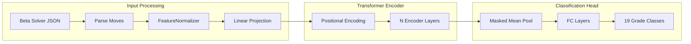

# Beta Classifier

Standalone project for classifying climbing grades from beta solver move sequences.

## Project Structure

```javascript
beta-classifier/
├── pyproject.toml          # Dependencies, uses moonboard_core
├── config.yaml             # Training configuration
├── main.py                 # CLI entry point
├── README.md
├── src/
│   ├── __init__.py
│   ├── dataset.py          # Data loading, normalization, splitting
│   ├── model.py            # Transformer architecture
│   ├── trainer.py          # Training loop with attention masks
│   ├── evaluator.py        # Metrics and evaluation
│   └── predictor.py        # Inference interface
├── models/                 # Saved checkpoints
│   └── .gitkeep
└── tests/
    ├── __init__.py
    ├── test_dataset.py
    ├── test_model.py
    └── test_predictor.py
```


## Dependencies (pyproject.toml)

```toml
[project]
name = "beta-classifier"
version = "0.1.0"
description = "Climbing grade classifier using move sequences from beta solver"
authors = [{name = "Moonboard Grader Team"}]
requires-python = ">=3.10"
dependencies = [
    "torch>=2.5.0",
    "numpy>=1.26.0",
    "scikit-learn>=1.6.0",
    "pyyaml>=6.0.2",
    "matplotlib>=3.9.0",
    "seaborn>=0.13.0",
    "tensorboard>=2.18.0",
    "tqdm>=4.67.0",
    "moonboard_core",
]

[project.optional-dependencies]
dev = [
    "pytest>=8.3.0",
    "pytest-cov>=6.0.0",
]

[build-system]
requires = ["setuptools>=75.0", "wheel"]
build-backend = "setuptools.build_meta"

[tool.setuptools.packages.find]
where = ["."]
include = ["src*"]

[tool.uv.sources]
moonboard_core = { path = "../moonboard_core", editable = true }
```


## Architecture Overview




## Input Features (15 per move)

| Feature | Type | Range | Normalization ||---------|------|-------|---------------|| targetX | Position | 0-10 | z-score from training || targetY | Position | 0-17 | z-score from training || stationaryX | Position | 0-10 | z-score from training || stationaryY | Position | 0-17 | z-score from training || originX | Position | 0-10 | z-score from training || originY | Position | 0-17 | z-score from training || targetDifficulty | Score | ~0-10 | z-score from training || stationaryDifficulty | Score | ~0-10 | z-score from training || originDifficulty | Score | ~0-10 | z-score from training || bodyStretchDx | Delta | ~-10 to 10 | z-score from training || bodyStretchDy | Delta | ~-17 to 17 | z-score from training || travelDx | Delta | ~-10 to 10 | z-score from training || travelDy | Delta | ~-17 to 17 | z-score from training || hand | Categorical | 0 or 1 | Keep as-is || successScore | Score | 0-1 | z-score from training |

## Implementation Details

### 1. Dataset Module (`src/dataset.py`)

```python
class FeatureNormalizer:
    """Fit on training data only, persist for inference."""
    
    def fit(self, train_sequences: List[np.ndarray]) -> 'FeatureNormalizer':
        all_features = np.concatenate(train_sequences, axis=0)
        self.mean = all_features.mean(axis=0)  # (15,)
        self.std = all_features.std(axis=0)
        self.std[self.std == 0] = 1.0
        return self
    
    def transform(self, sequences: List[np.ndarray]) -> List[np.ndarray]:
        return [(seq - self.mean) / self.std for seq in sequences]
    
    def save(self, path: str):
        np.savez(path, mean=self.mean, std=self.std)
    
    @classmethod
    def load(cls, path: str) -> 'FeatureNormalizer':
        data = np.load(path)
        norm = cls()
        norm.mean, norm.std = data['mean'], data['std']
        return norm


class MoveSequenceDataset(Dataset):
    def __init__(self, sequences: List[np.ndarray], labels: np.ndarray):
        self.sequences = sequences  # Variable length, already normalized
        self.labels = labels
    
    def __getitem__(self, idx):
        return torch.FloatTensor(self.sequences[idx]), self.labels[idx]
    
    def __len__(self):
        return len(self.sequences)


def collate_fn(batch):
    """Pad sequences to max length in batch, create attention masks."""
    sequences, labels = zip(*batch)
    lengths = [len(s) for s in sequences]
    max_len = max(lengths)
    
    padded = torch.zeros(len(batch), max_len, 15)
    mask = torch.zeros(len(batch), max_len)
    
    for i, (seq, length) in enumerate(zip(sequences, lengths)):
        padded[i, :length] = seq
        mask[i, :length] = 1.0
    
    return padded, mask, torch.LongTensor(labels)
```

**Data Pipeline (no leakage):**

1. Load raw JSON from beta solver
2. Extract features → List of (seq_len, 15) arrays
3. Split by indices (stratified by grade)
4. Fit normalizer on TRAIN split only
5. Transform all splits with training stats
6. Save normalizer alongside model

### 2. Model Module (`src/model.py`)

```python
class TransformerSequenceClassifier(nn.Module):
    def __init__(
        self,
        input_dim: int = 15,
        d_model: int = 64,
        n_heads: int = 4,
        n_layers: int = 2,
        num_classes: int = 19,
        dropout: float = 0.1,
        max_seq_len: int = 50
    ):
        super().__init__()
        self.input_projection = nn.Linear(input_dim, d_model)
        self.pos_encoding = nn.Embedding(max_seq_len, d_model)
        
        encoder_layer = nn.TransformerEncoderLayer(
            d_model=d_model,
            nhead=n_heads,
            dim_feedforward=d_model * 4,
            dropout=dropout,
            batch_first=True
        )
        self.transformer = nn.TransformerEncoder(encoder_layer, num_layers=n_layers)
        
        self.classifier = nn.Sequential(
            nn.Linear(d_model, d_model),
            nn.ReLU(),
            nn.Dropout(dropout),
            nn.Linear(d_model, num_classes)
        )
    
    def forward(self, x: Tensor, mask: Tensor) -> Tensor:
        # x: (batch, seq_len, 15)
        # mask: (batch, seq_len) - 1 for real, 0 for padding
        
        batch_size, seq_len, _ = x.shape
        
        # Project and add positional encoding
        x = self.input_projection(x)
        positions = torch.arange(seq_len, device=x.device)
        x = x + self.pos_encoding(positions)
        
        # Create attention mask (True = ignore)
        attn_mask = (mask == 0)
        
        # Transformer encoding
        x = self.transformer(x, src_key_padding_mask=attn_mask)
        
        # Masked mean pooling
        mask_expanded = mask.unsqueeze(-1)
        x = (x * mask_expanded).sum(dim=1) / mask_expanded.sum(dim=1)
        
        return self.classifier(x)
```


### 3. Trainer Module (`src/trainer.py`)

```python
class Trainer:
    def __init__(self, model, train_loader, val_loader, optimizer, criterion, 
                 device, checkpoint_dir, scheduler=None):
        # Standard setup...
    
    def train_epoch(self) -> float:
        self.model.train()
        total_loss = 0
        
        for batch_data, attention_mask, batch_labels in self.train_loader:
            batch_data = batch_data.to(self.device)
            attention_mask = attention_mask.to(self.device)
            batch_labels = batch_labels.to(self.device)
            
            self.optimizer.zero_grad()
            outputs = self.model(batch_data, attention_mask)
            loss = self.criterion(outputs, batch_labels)
            loss.backward()
            self.optimizer.step()
            
            total_loss += loss.item()
        
        return total_loss / len(self.train_loader)
    
    def save_checkpoint(self, filename: str):
        checkpoint = {
            'model_state_dict': self.model.state_dict(),
            'optimizer_state_dict': self.optimizer.state_dict(),
            'epoch': self.current_epoch,
            'best_val_loss': self.best_val_loss,
            'model_config': self.model_config,  # For reconstruction
        }
        torch.save(checkpoint, self.checkpoint_dir / filename)
```


### 4. Predictor Module (`src/predictor.py`)

```python
class Predictor:
    def __init__(self, checkpoint_path: str, normalizer_path: str, device: str = "cpu"):
        self.device = device
        self.normalizer = FeatureNormalizer.load(normalizer_path)
        
        checkpoint = torch.load(checkpoint_path, map_location=device)
        self.model = TransformerSequenceClassifier(**checkpoint['model_config'])
        self.model.load_state_dict(checkpoint['model_state_dict'])
        self.model.to(device).eval()
    
    def predict(self, problem: Dict) -> Dict:
        """Predict grade from beta solver output."""
        # Extract features from moves
        features = self._extract_features(problem['moves'])
        features = self.normalizer.transform([features])[0]
        
        # Create tensors
        x = torch.FloatTensor(features).unsqueeze(0).to(self.device)
        mask = torch.ones(1, len(features)).to(self.device)
        
        with torch.no_grad():
            logits = self.model(x, mask)
            probs = F.softmax(logits, dim=1)
        
        pred_idx = probs.argmax().item()
        return {
            'predicted_grade': decode_grade(pred_idx),
            'confidence': probs[0, pred_idx].item(),
            'all_probabilities': {decode_grade(i): p.item() for i, p in enumerate(probs[0])}
        }
    
    def _extract_features(self, moves: List[Dict]) -> np.ndarray:
        """Extract 15 features from each move."""
        features = []
        for m in moves:
            features.append([
                m['targetX'], m['targetY'],
                m['stationaryX'], m['stationaryY'],
                m['originX'], m['originY'],
                m['targetDifficulty'], m['stationaryDifficulty'], m['originDifficulty'],
                m['bodyStretchDx'], m['bodyStretchDy'],
                m['travelDx'], m['travelDy'],
                m['hand'], m['successScore']
            ])
        return np.array(features, dtype=np.float32)
```


### 5. Configuration (`config.yaml`)

```yaml
model:
  d_model: 64
  n_heads: 4
  n_layers: 2
  dropout: 0.1
  max_seq_len: 50
  num_classes: 19

training:
  learning_rate: 0.0001
  batch_size: 64
  num_epochs: 150
  early_stopping_patience: 10
  optimizer: "adam"
  weight_decay: 0.0001
  use_class_weights: true
  label_smoothing: 0.1

data:
  path: "../data/solved_problems.json"
  train_ratio: 0.7
  val_ratio: 0.15
  test_ratio: 0.15
  random_seed: 42

checkpoint:
  dir: "models"
  save_best: true

device: "cuda"
```


### 6. CLI (`main.py`)

```python
def main():
    parser = argparse.ArgumentParser(description="Beta Classifier")
    subparsers = parser.add_subparsers()
    
    # Train command
    train_parser = subparsers.add_parser('train')
    train_parser.add_argument('--config', default='config.yaml')
    train_parser.set_defaults(func=train_command)
    
    # Evaluate command
    eval_parser = subparsers.add_parser('evaluate')
    eval_parser.add_argument('--checkpoint', required=True)
    eval_parser.add_argument('--normalizer', required=True)
    eval_parser.add_argument('--data', required=True)
    eval_parser.set_defaults(func=evaluate_command)
    
    # Predict command
    predict_parser = subparsers.add_parser('predict')
    predict_parser.add_argument('--checkpoint', required=True)
    predict_parser.add_argument('--normalizer', required=True)
    predict_parser.add_argument('--input', required=True)
    predict_parser.set_defaults(func=predict_command)
    
    args = parser.parse_args()
    args.func(args)
```

**Usage:**

```bash
# Train
py main.py train --config config.yaml

# Evaluate
py main.py evaluate --checkpoint models/best_model.pth --normalizer models/normalizer.npz --data ../data/test.json

# Predict
py main.py predict --checkpoint models/best_model.pth --normalizer models/normalizer.npz --input problem.json
```


## Saved Artifacts

| File | Contents ||------|----------|| `models/best_model.pth` | Model weights + model_config for reconstruction || `models/normalizer.npz` | mean/std arrays from training data || `models/confusion_matrix.png` | Evaluation visualization || `runs/` | TensorBoard logs |

## Comparison with Grid Classifier

| Aspect | Grid Classifier | Beta Classifier ||--------|-----------------|-----------------|| Input | Hold positions (3x18x11 grid) | Move sequences (N x 15 features) || Model | CNN / FC | Transformer || Normalization | None | FeatureNormalizer (persisted) || Training loop | 2-tuple batches | 3-tuple with attention mask || Dependencies | moonboard_core | moonboard_core || Project | classifier/ | beta-classifier/ |

## Success Metrics

- Exact accuracy (% predictions matching true grade)
- ±1 grade tolerance accuracy
- ±2 grade tolerance accuracy
- Mean absolute error (grades)
- Per-grade precision/recall/F1