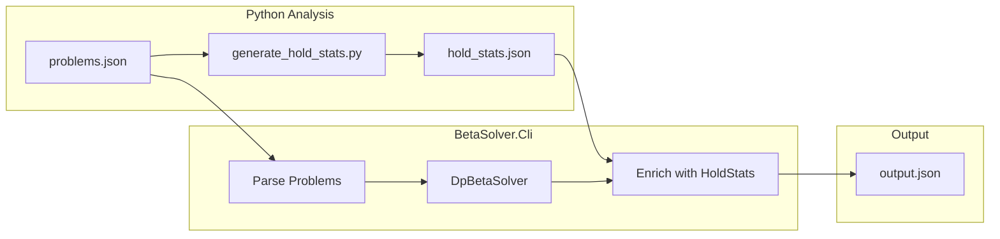

# Beta Solver CLI for ML Feature Generation

## Input/Output Design

**Input:** JSON file matching the moonboard problems format (array with `data` field containing problems)**Output:** JSON file with minimal fields + beta solution

### Output Schema per Problem

```json
{
  "apiId": 305445,
  "name": "Fat Guy In A Little Suit",
  "grade": "6B+",
  "moves": [
    {
      "targetX": 6,
      "targetY": 5,
      "hand": 0,
      "targetDifficulty": 5.2,
      "stationaryX": 9,
      "stationaryY": 3,
      "stationaryDifficulty": 4.8,
      "bodyStretchDx": -3,
      "bodyStretchDy": 2,
      "originX": 9,
      "originY": 3,
      "originDifficulty": 4.8,
      "travelDx": -3,
      "travelDy": 2,
      "successScore": 0.85
    }
  ]
}
```


### Per-Move Fields Explained

| Field | Description |

|-------|-------------|

| `targetX`, `targetY` | Coordinates of the hold being grabbed (0-10, 0-17) |

| `hand` | Which hand grabs the target (0 = LH, 1 = RH) |

| `targetDifficulty` | Difficulty rating of the target hold (1-10) |

| `stationaryX`, `stationaryY` | Coordinates of where the other hand remains |

| `stationaryDifficulty` | Difficulty of the stationary hand's hold |

| `bodyStretchDx`, `bodyStretchDy` | Vector from stationary hold → target (body stretch) |

| `originX`, `originY` | Coordinates of the hold the moving hand is leaving |

| `originDifficulty` | Difficulty of the moving hand's previous hold |

| `travelDx`, `travelDy` | Vector from origin → target (hand travel distance) |

| `successScore` | Calculated ease factor from the solver (0-1) |

### Hold Difficulty Calculation (1-10 Scale)

**Computed in the CLI** at runtime from the `meanGrade` field in `hold_stats.json`:

```csharp
holdDifficulty = 1 + (meanGradeIndex * 9.0 / 18.0)
```

This maps the grade index (0-18) to a 1-10 difficulty scale. The `meanGrade` is already corrected for dataset imbalance via weighted averaging in the Python analysis script.

## Implementation Steps

### ~~0. Python - Add holdDifficulty to hold_stats.json~~ (SKIPPED)

> **Decision:** Not implementing a separate `holdDifficulty` field. The existing `meanGrade` (weighted mean, already corrected for dataset imbalance) provides the same signal. A composite formula would be redundant — the CLI can derive difficulty directly from mean grade index: `difficulty = 1 + (meanGradeIndex * 9 / 18)`.

### ~~1. Frontend - Expose holdDifficulty~~ (SKIPPED)

> **Decision:** Skipped since Step 0 was not implemented. The frontend already displays `meanGrade` which serves the same purpose.

### ~~2. Core Library - Enhanced Beta Result~~ ✅ DONE

Updated `BetaSolver.Core/Solver/Beta.cs` to include per-move context:

- Created `ScoredMove` record with full spatial context:
    - `TargetHold`, `Hand`, `Score`
    - `StationaryHold` (where the other hand is)
    - `OriginHold` (where the moving hand came from)
- Updated `DpBetaSolver` to track origin/stationary positions and return `ScoredMove` list
- Updated `SolveProblemResponse.cs` in the API to work with new structure

### ~~3. CLI Contracts~~ ✅ DONE

Created DTOs in `BetaSolver.Cli/Contracts/`:

- `InputProblemsFile.cs` - deserializes moonboard JSON format with `InputProblem` and `InputMove` records
- `OutputProblem.cs` - output schema with moves array
- `OutputMove.cs` - per-move DTO with all spatial fields (coordinates, difficulties, vectors, score)
- `HoldStatsFile.cs` - deserializes hold_stats.json with `HoldStats` record that computes `Difficulty` from `meanGrade`

### 4. CLI Implementation

Update [`BetaSolver.Cli/Program.cs`](BetaSolver.Cli/Program.cs) with:

- Command-line argument parsing (input file, output file)
- Hardcoded path to hold_stats.json (relative to project)
- JSON deserialization of moonboard problems format
- Processing loop that solves each problem
- Hold stats loading and lookup (for difficulty values)
- JSON serialization of output with per-move spatial data

## ML-Optimized Output Format

The per-move output provides all spatial context needed for ML:

- **Coordinates** — Raw X/Y positions for target, origin, and stationary holds
- **Distance vectors** — `(dx, dy)` tuples for both body stretch and hand travel
- **Hold difficulties** — 1-10 score for each of the three holds involved in a move
- **Success score** — Solver's calculated ease factor (0-1)

This format allows the ML model to:

- Learn spatial patterns (cross-body moves, dynamic reaches, etc.)
- Correlate hold positions with difficulty
- Understand body positioning throughout the sequence

## Data Flow




## CLI Usage

```bash
dotnet run --project BetaSolver.Cli -- --input problems.json --output solved.json

```